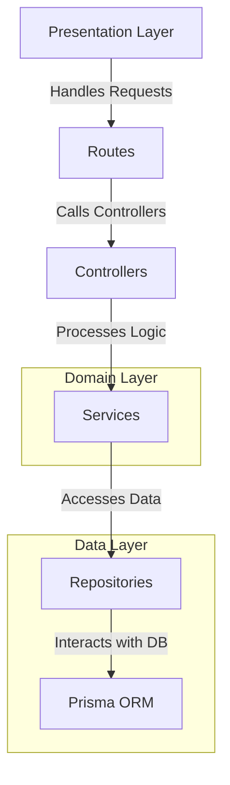
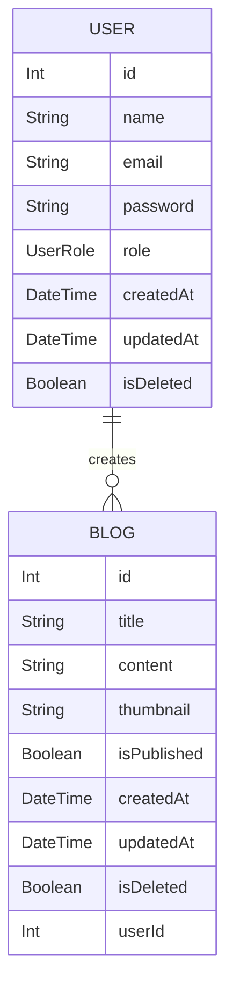

# PusatAndalan Blog API

This is the backend API for a blog management system with role-based authentication built with Express.js and Prisma.

This project follows a clean architecture approach, which aims to separate concerns and create a maintainable and scalable codebase. Here's a brief explanation of the structure:

## Architecture:



### 📁 Project Structure

This project follows a clean and organized structure, ensuring maintainability and scalability. Below is an overview of the main directories and files:

### 📂 Root Directories

- **`api/`** - Entry point for the API, responsible for initializing and configuring the server.
- **`prisma/`** - Contains database schema and migration files.
- **`public/`** - Serves static files used by the application.
  - **`swagger-ui/`** - Assets for API documentation using Swagger UI.
- **`src/`** - Main source code directory.

### 📂 Source Code (`src/`)

#### 🏗️ Architecture Layers

- **`controllers/`** - Handles HTTP requests and responses.
- **`routes/`** - Defines API endpoints and connects them to controllers.
- **`services/`** - Contains business logic and core application functionality.
- **`repositories/`** - Manages database operations and interactions.
- **`models/`** - Defines data structures and database models.

#### 🔧 Supporting Modules

- **`middleware/`** - Custom middleware functions for request handling.
- **`utils/`** - Utility functions to support the application.
- **`types/`** - TypeScript type definitions for better type safety.
- **`docs/`** - OPEN API documentation.

## 🛠️ Configuration Files

- **`package.json`** - Project manifest file.
- **`tsconfig.json`** - TypeScript configuration file.
- **`vercel.json`** - Configuration for deployment on Vercel.

## API Endpoints

### Authentication

- `POST /api/auth/sign-up` - Register a new user
- `POST /api/auth/sign-in` - Log in an existing user
- `GET /api/auth/authorize` - Authorize a user session

### Blogs

- `GET /api/blogs` - Retrieve all blogs (role-based filtering)
- `POST /api/blogs` - Create a new blog
- `GET /api/blogs/:id` - Retrieve a specific blog by ID
- `PUT /api/blogs/:id` - Update a specific blog by ID (owner/admin only)
- `DELETE /api/blogs/:id` - Delete a specific blog by ID (owner/admin only)
- `GET /api/blogs/my` - Get current user's blogs
- `GET /api/blogs/user/:userId` - Get blogs by user ID

## Getting Started

### Prerequisites

- Node.js
- npm

### Installation

1. Clone the repository:

```sh
git clone <repository-url> pusatandalan-blog-api
```

2. Navigate to the project directory:

```sh
cd pusatandalan-blog-api
```

3. Install dependencies:

```sh
npm install
```

### Database Setup

#### ERD



1. Set up your environment variables:

```sh
cp .env.example .env
# Edit .env with your database URL and JWT secret
```

2. Migrate prisma database:

```sh
npx prisma migrate dev --name init
```

3. Seed the database with superadmin user:

```sh
npm run seed
```

**Default Superadmin Credentials:**

- Email: `superadmin@pusatandalan.com`
- Password: `superadmin123`
- Role: `SUPERADMIN`

### Running the Server

1. Start the development server:

```sh
npm start
```

## Contributing

Contributions are welcome! Please open an issue or submit a pull request.

## License

This project is licensed under the MIT License.
